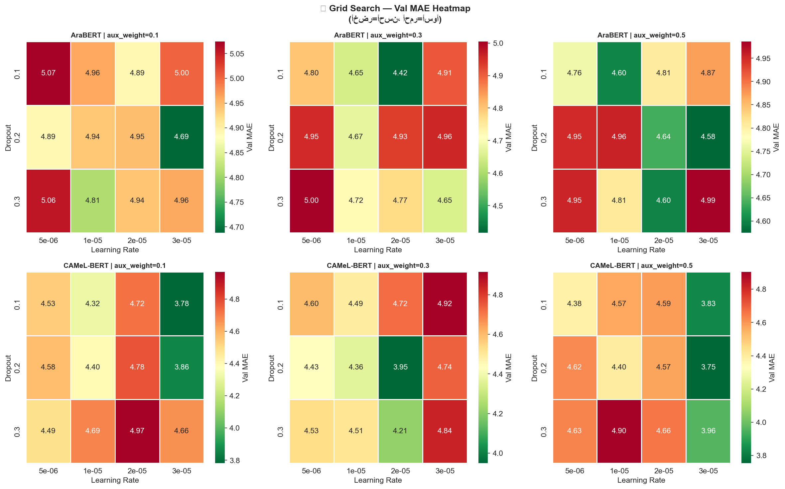
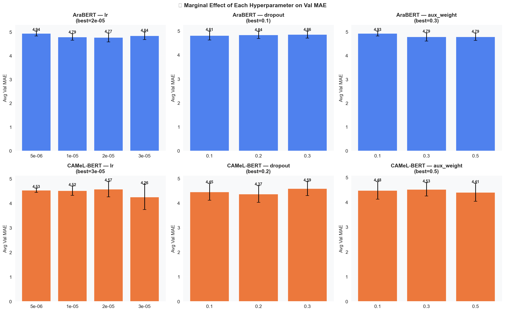

# Development Journey

This document is a chronological account of how this project evolved —
the bugs found, the decisions made, and why. The numbered notebooks and
scripts in this repository correspond directly to the phases described
below, so you can follow the actual code at each stage rather than just
reading about it.

---

## Table of Contents

1. [Phase 0 — Dataset Generation](#phase-0--dataset-generation)
2. [Phase 1 — Baseline Notebook Audit](#phase-1--baseline-notebook-audit)
3. [Phase 2 — Environment & Dependency Issues](#phase-2--environment--dependency-issues)
4. [Phase 3 — Raising Accuracy: Ensemble & Dynamic Thresholds](#phase-3--raising-accuracy-ensemble--dynamic-thresholds)
5. [Phase 4 — The Threshold Collapse Bug](#phase-4--the-threshold-collapse-bug)
6. [Phase 5 — Grid Search](#phase-5--grid-search)
7. [Phase 6 — The Real Bottleneck: Class Imbalance](#phase-6--the-real-bottleneck-class-imbalance)
8. [Phase 7 — A Silent Bug: Keyword Matching Was Broken](#phase-7--a-silent-bug-keyword-matching-was-broken)
9. [Phase 8 — Production Deployment](#phase-8--production-deployment)
10. [Key Takeaways](#key-takeaways)

---

## Phase 0 — Dataset Generation

**Scripts:** [`scripts/data_generation/`](./scripts/data_generation/)

No public Arabic CV dataset with suitability/ATS labels existed, so the
training data had to be synthesized — by translating an English résumé
dataset and enriching it with market-relevant context. All three script
versions follow the same two-source approach: job postings from the
**ArabJobs** dataset are summarized per category (top skills,
qualifications, average experience) via an LLM call, and those
category-level requirements are then used as context when generating
improvement suggestions for each translated CV. This went through three
iterations:

### v1 — Cloud LLM (Groq), separate calls per step

[`cv_arabizer_v1.py`](./scripts/data_generation/cv_arabizer_v1.py)
translated each CV and generated suggestions as two separate calls to
Groq's `llama-4-scout-17b-16e-instruct`, with a smart retry mechanism that
parses the provider's own `"Please try again in Xm Ys"` message to wait
the exact required time before retrying:

```python
def parse_retry_after(error_message):
    match = re.search(r'Please try again in (\d+)m([\d.]+)s', str(error_message))
    ...
```

This worked, but Groq's rate limits made generating thousands of CVs
impractically slow — consistent with the broader pattern of hitting quota
limits on Gemini, Groq, and the HuggingFace Inference API in this project.

> ⚠️ **Note:** the original script had a Groq API key hardcoded directly
> in the source. It has been redacted here to read from the
> `GROQ_API_KEY` environment variable instead (see
> [`.env.example`](./.env.example)) — never commit real API keys to
> version control.

### v2 — Local LLM (Ollama), still two calls per step

[`cv_arabizer_v2.py`](./scripts/data_generation/cv_arabizer_v2.py) moved
generation entirely to a local `qwen2.5:7b` model served via Ollama,
removing rate limits at the cost of generation speed depending on local
hardware. Translation and suggestion-generation were still two separate
prompts per CV.

### v3 — Combined call + resume/checkpoint support (final)

[`cv_arabizer_v3.py`](./scripts/data_generation/cv_arabizer_v3.py) merged
translation and suggestion generation into a single structured prompt
(parsed back into two fields with a regex), roughly halving the number of
LLM calls. It also added:
- **Resume support** — on startup, it loads the existing output CSV (if
  any) and only processes CVs not already done.
- **A repair pass** — re-processes any existing rows with missing/empty
  `arabic_cv` or `suggestions` fields before moving on to new ones.
- **Periodic backups** — saves progress to disk every 25 CVs.

This produced `arabic_cvs_output.csv` — **2,484** translated CVs with
suggestions, each labeled with its original Kaggle category and ID.

ATS scores and suitability scores (the regression target used for
training) were then computed for each CV, producing
`arabic_cvs_with_scores.csv` — the file every notebook downstream of this
phase expects as input.

---

## Phase 1 — Baseline Notebook Audit

**Notebook:** [`01_baseline_dual_model_comparison.ipynb`](./notebooks/01_baseline_dual_model_comparison.ipynb)

The first version of the training notebook compared AraBERT vs CAMeL-BERT
with attention pooling over sliding-window chunks. Auditing it surfaced
three concrete bugs:

| Bug | Symptom | Fix |
|-----|---------|-----|
| Checkpoint filename mismatch | Evaluation section tried to load `final_{model}.pt`, but training saved `model_{model}_full.pt` | Unified the save/load filename |
| `output_attentions` inconsistency | `forward()` set `output_attentions=False` but explainability code tried to read `out.attentions` → crash | Model returns `score` only; a separate eager-attention pass is used only for explainability |
| Unbounded grid search | The original notebook ran a full grid search (8 combos × 3 epochs × 2 models = 48 runs) every time, even for small changes | Removed for this stage; reintroduced later as a deliberately scoped search (Phase 5) |

---

## Phase 2 — Environment & Dependency Issues

Before any modeling work could continue, a string of environment issues
had to be resolved on the local Windows + CUDA setup:

- **`torch.load` security restriction (CVE-2025-32434):** newer
  `transformers` versions refuse to call `torch.load` unless
  `torch >= 2.6`. Fixed by upgrading PyTorch (`pip install torch==2.6.0
  --index-url .../cu124`).
- **`torchvision`/`torch` version mismatch:** upgrading `torch` alone
  broke `torchvision`'s compiled operators (`operator torchvision::nms
  does not exist`), which in turn broke `transformers` imports. Fixed by
  reinstalling a matching `torchvision` build.
- **Stale kernel state:** after upgrading packages, the Jupyter kernel
  still reported the old `torch` version until restarted — a reminder
  that `pip install` doesn't affect an already-running process.
- **SDPA vs eager attention:** PyTorch's default scaled-dot-product
  attention backend doesn't support `output_attentions=True`. Any
  explainability code needs an `attn_implementation="eager"` copy of the
  encoder.

---

## Phase 3 — Raising Accuracy: Ensemble & Dynamic Thresholds

**Notebook:** [`02_ensemble_dynamic_thresholds.ipynb`](./notebooks/02_ensemble_dynamic_thresholds.ipynb)

With a clean baseline in place, the focus shifted to accuracy, which was
stuck in the low 60s. Changes made in this phase:

- **Data-driven thresholds:** replaced fixed score cut-offs (50/70/85)
  with percentile-based thresholds (P25/P50/P75) computed from the
  training data itself.
- **HuberMSE loss:** combined Huber loss with MSE to reduce sensitivity
  to outlier scores.
- **Freeze → unfreeze training:** the BERT encoder is frozen for the
  first epochs (training only the head), then unfrozen for full
  fine-tuning — more stable than unfreezing everything from epoch 1.
- **Layer-wise learning-rate decay:** deeper BERT layers get
  progressively smaller learning rates than the task-specific head.
- **Ensemble:** AraBERT and CAMeL-BERT predictions are combined, weighted
  inversely to each model's validation MAE.

---

## Phase 4 — The Threshold Collapse Bug

**Notebook:** [`03_dual_loss_smart_thresholds.ipynb`](./notebooks/03_dual_loss_smart_thresholds.ipynb)

Running the Phase 3 notebook on the real dataset exposed a new failure
mode — the percentile thresholds *collapsed*:

```
ضعيف  < 68.0
متوسط < 82.0
جيد   < 82.0   ← T2 == T3, "جيد" class became empty
ممتاز ≥ 82.0
```

The dataset's score distribution was concentrated in a narrow band
(roughly 60–90), so P50 and P75 landed on the same value. The model had
effectively only 3 usable classes instead of 4.

**Fixes:**

- **Smart thresholds:** detect a narrow/collapsing distribution and fall
  back to equal-width spacing across the actual score range, with an
  enforced minimum gap between thresholds.
- **Score rescaling:** rescale raw scores to `[0, 1]` based on the
  dataset's *actual* min/max (not an assumed `[0, 100]`), so the
  regression head sees larger, more learnable differences between CVs.
- **Dual-head architecture:** added a classification head alongside the
  regression head, trained jointly via a combined loss
  (`DualLoss = (1 - aux_weight) * regression_loss + aux_weight * classification_loss`),
  so the model is explicitly pushed to learn class boundaries, not just
  a continuous score.
- **Class weights:** computed balanced class weights for the
  classification loss term.

---

## Phase 5 — Grid Search

**Notebook:** [`04_gridsearch_final_pipeline.ipynb`](./notebooks/04_gridsearch_final_pipeline.ipynb)

A full grid search over every hyperparameter was deliberately avoided —
it would mean 144+ combinations × 2 models × several epochs, taking days.
Instead, a **focused** grid search targeted the three hyperparameters with
the highest expected impact:

| Parameter | Values | Why |
|-----------|--------|-----|
| `lr` | `5e-6, 1e-5, 2e-5, 3e-5` | Most influential for BERT fine-tuning |
| `dropout` | `0.1, 0.2, 0.3` | Controls overfitting |
| `aux_weight` | `0.1, 0.3, 0.5` | Balance between regression and classification loss |

This gave 36 combinations × 2 models × 3 short proxy epochs (216 runs,
hours instead of days), after which full training (10 epochs, early
stopping) ran automatically with the best parameters found.

**Actual results from this search:**

| | |
|---|---|
|  |  |

Validation MAE across the `lr` × `dropout` grid for each `aux_weight`
value (left), and the marginal effect of each hyperparameter averaged
over the others (right) — used to pick the best configuration per model
without needing to inspect all 36 combinations manually.


Final per-model evaluation after retraining with the selected
hyperparameters — confusion matrices, regression metrics, and F1 per
class, for both AraBERT and CAMeL-BERT. *(This snapshot is from one grid
search run; see Phase 6 for what these per-class numbers revealed and
how they were ultimately improved.)*

---

## Phase 6 — The Real Bottleneck: Class Imbalance

Even after all the above, accuracy plateaued in the **low-to-mid 70s**.
Breaking down per-class F1 scores told a clear story:

```
ضعيف : f1 = 0.89   ✅
متوسط: f1 = 0.41   ❌ badly confused with neighbors
جيد  : f1 = 0.66   ⚠️ recall=1.00 but precision=0.49 (over-predicted)
ممتاز: f1 = 0.84   ✅
```

### Root cause #1 — the balancing script only topped up, it never capped

**Script:** [`balance_dataset_v1.py`](./scripts/balance_dataset_v1.py)

The first dataset-balancing script generated additional synthetic CVs for
under-represented score ranges up to a *fixed* target (400 per class). But
it never reduced the over-represented "ممتاز" class, which had 1,805
samples. After "balancing," the actual training distribution was still:

```
ضعيف :  323 (12.5%)
متوسط:  500 (19.3%)
جيد  :  324 (12.5%)
ممتاز: 1443 (55.7%)   ← still dominant
```

### Root cause #2 — only half the loss was class-weighted

The `DualLoss` from Phase 4 applied class weights to the classification
term, but **not** to the regression term (MSE/Huber) — which made up the
majority of the loss magnitude. The dominant class was still implicitly
steering the regression objective.

### The fix — top up, never trim

An early fix attempt capped (undersampled) the majority class down to a
fixed target. This was explicitly rejected in favor of an
**additive-only** approach: never delete real data, only generate more
for the classes that need it.

**Script:** [`balance_dataset_v3.py`](./scripts/balance_dataset_v3.py)
(superseding [`v2`](./scripts/balance_dataset_v2.py), which added resume
support and retry logic but still used a fixed target)

```python
TARGET = max(current_distribution.values())  # dynamic, not a fixed number
```

Every minority class is topped up to match the size of the *current*
majority class — no data is ever removed. Combined with making the
regression loss class-weighted too (`reg_loss * class_weight[label]`),
and switching the late-training learning-rate schedule from linear to
cosine (the linear schedule showed erratic loss spikes near the end of
training), this directly targeted the imbalance without sacrificing any
real samples.

---

## Phase 7 — A Silent Bug: Keyword Matching Was Broken

While auditing the ATS scoring logic for the grid search notebook, another
silent bug surfaced: `DOMAIN_KEYWORDS` was keyed by **Arabic** category
names (`'تكنولوجيا المعلومات'`), but the actual `category` column in the
dataset held **English** values (`'INFORMATION-TECHNOLOGY'`). Every lookup
silently fell back to generic default keywords — the domain-specific ATS
keyword matching had effectively never worked.

**Fix:** re-keyed `DOMAIN_KEYWORDS` to the real English category values
(covering all 24 categories actually present in the data, not just the
original 10), and added a `CATEGORY_AR` translation map used only when
building the BERT input text.

This is a good example of why distribution diagnostics (printing actual
value samples, not just assuming a schema) matter before trusting any
downstream score.

---

## Phase 8 — Production Deployment

With training stabilized, the trained checkpoints were wrapped into a
production API and deployed directly to Hugging Face Spaces (the API
source code lives there, not in this repository — see the
[live Space](https://huggingface.co/spaces/omaraboelmaaty/Arabic_CV_Analyzer_API)).
The same checkpoints and their config are archived in this repository
under [`saved_model/`](./saved_model/) for reproducibility.

The API source code itself is structured as follows:

- **`model_classes.py`** — the exact training-time architecture,
  required to load the saved `state_dict` correctly.
- **`ats_engine.py`** — the same text-cleaning and ATS-scoring logic
  used during training, so inference-time preprocessing matches training
  exactly.
- **`inference.py`** — loads both models once at startup, exposes the
  ensemble logic, and lazily loads an eager-attention copy only if
  explainability is requested.
- **`main.py`** + **`schemas.py`** — a FastAPI service with
  `/analyze`, `/info`, and `/health` endpoints.

**Deployment:**
- Containerized with a Hugging Face Spaces–compatible `Dockerfile`
  (non-root user, port `7860`, writable HF cache directories).
- Large checkpoint files tracked with Git LFS.
- CPU-only PyTorch wheel used in `requirements.txt` for faster builds on
  the free Spaces tier.
- Deployed to: https://huggingface.co/spaces/omaraboelmaaty/Arabic_CV_Analyzer_API

**Documentation:**
- The Space's `README.md` follows Hugging Face's card format (YAML
  frontmatter with `license`, `short_description` under the 60-character
  limit, `app_port`, etc.).
- A separate `HOW_TO_USE_API.md` documents every endpoint for external
  consumers, with a worked example for each — deliberately written
  without implementation details, since that audience cares about
  consuming the API, not its internals.
- All code comments, docstrings, and log/error messages were written or
  translated to English, since Hugging Face is a primarily
  English-speaking platform — while the Arabic NLP domain content itself
  (class names, keyword lists, suggestion templates) was deliberately
  left untouched, since that's the actual product output for
  Arabic-speaking job seekers, not documentation.

---

## Key Takeaways

- **Class imbalance is rarely fixed by "topping up" alone** — if the
  dominant class is never addressed, the dataset stays skewed regardless
  of how much minority data you add. (Here, solved by making the target
  itself dynamic instead of fixed.)
- **Weight every loss term, not just one** — a multi-term loss is only as
  balanced as its least-weighted component.
- **Distribution diagnostics before trusting thresholds** — percentile-
  based thresholds can silently collapse on narrow or skewed
  distributions; always print and inspect the actual numbers.
- **Schema mismatches fail silently** — a keyword dictionary keyed in the
  wrong language doesn't throw an error, it just always returns the
  default. Defensive logging (or assertions) around `.get(key, default)`
  patterns would have caught this earlier.
- **Match training-time preprocessing exactly at inference time** — the
  API's `ats_engine.py` and `model_classes.py` are deliberately verbatim
  copies of the training logic, not reimplementations, to avoid subtle
  train/serve skew.
- **Prefer additive fixes over destructive ones** — generating more data
  for underrepresented classes preserves information; deleting
  overrepresented data throws it away. Both can mathematically "balance"
  a dataset, but they are not equivalent in value.
