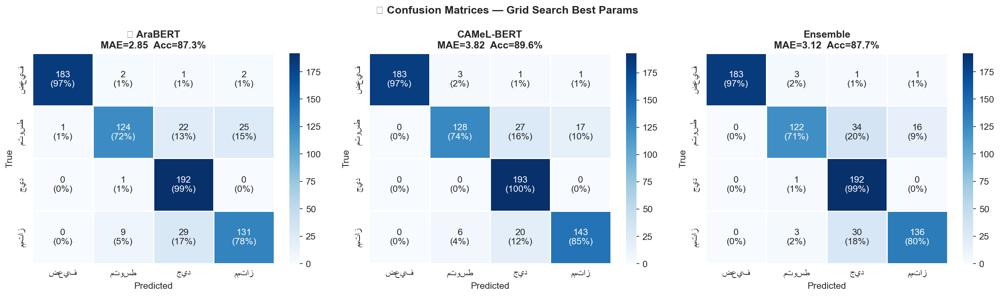

# Arabic CV Analyzer

An end-to-end NLP pipeline that scores and classifies Arabic CVs, and
generates structured improvement suggestions — built for Arabic-speaking
job seekers, with a focus on students entering the job market.

🔗 **Try the live API:** https://huggingface.co/spaces/omaraboelmaaty/Arabic_CV_Analyzer_API
📖 **Full development journey:** [`JOURNEY.md`](./JOURNEY.md) — every bug found, every fix, in chronological order

> ⚠️ This repository uses **Git LFS** for the dataset CSVs and model
> checkpoints. Install it before cloning:
> ```bash
> git lfs install
> git clone <repo-url>
> ```
> Cloning without `git lfs install` first will leave you with small
> pointer files instead of the actual data/weights.

---

## Overview

Given a CV written in Arabic and a target job category, the system returns:

- A **suitability score** (0–100)
- A **classification** — ضعيف (Weak) / متوسط (Average) / جيد (Good) / ممتاز (Excellent)
- An **ATS compatibility score** (Applicant Tracking System keyword/structure check)
- **Matched / missing keywords** for the target job category
- **Actionable improvement suggestions**

The project covers the full lifecycle: synthetic dataset generation, dual-model
fine-tuning, hyperparameter search, and production deployment as a REST API.



---

## How it works

```
Raw English résumé dataset (Kaggle)
        │  translation + enrichment (local LLM via Ollama)
        ▼
Synthetic Arabic CV dataset + suitability scores + ATS rules
        │  class balancing (top-up minority classes)
        ▼
Fine-tuning: AraBERT + CAMeL-BERT
  ├─ Sliding-window chunking (long CVs) + Attention Pooling
  ├─ Dual-head architecture: regression (score) + classification (class)
  ├─ Freeze → unfreeze training, layer-wise LR decay, cosine schedule
  └─ Grid search over lr / dropout / classification-loss weight
        │
        ▼
Ensemble (weighted by validation MAE) + ATS rule engine + suggestions
        │
        ▼
Deployed as a FastAPI service on Hugging Face Spaces (Docker)
```

---

## Results

| Model | Best MAE | Best Epoch |
|-------|----------|------------|
| AraBERT | 3.29 | 6 |
| CAMeL-BERT | 4.04 | 4 |

Final predictions combine both models as a weighted ensemble
(`AraBERT: 0.57`, `CAMeL-BERT: 0.43`), with classification thresholds at
`55.5 / 70.5 / 79.5` separating the four suitability classes.

---

## Repository structure

```
.
├── JOURNEY.md                              # Full development journey — every bug & fix, in order
├── requirements.txt                          # Curated dependencies to reproduce the pipeline
├── .env.example                                # Template for the one optional secret (legacy Groq key)
├── .gitattributes                                # Git LFS rules (*.csv, *.pt, *.bin, *.safetensors)
├── data/
│   ├── raw/
│   │   ├── Resume.csv                       # Kaggle resume-dataset (2,484 English CVs)
│   │   └── ArabJobs.csv                      # Arabic job postings (market requirements source)
│   └── processed/
│       ├── arabic_cvs_output.csv              # After translation + suggestions (cv_arabizer)
│       ├── arabic_cvs_with_scores.csv          # + suitability_score, ats_score
│       └── arabic_cvs_balanced.csv              # Final, class-balanced (~7,200 rows)
├── notebooks/
│   ├── 01_baseline_dual_model_comparison.ipynb
│   ├── 02_ensemble_dynamic_thresholds.ipynb
│   ├── 03_dual_loss_smart_thresholds.ipynb
│   └── 04_gridsearch_final_pipeline.ipynb   # Final notebook used to produce the deployed models
├── scripts/
│   ├── data_generation/
│   │   ├── cv_arabizer_v1.py             # Groq (cloud) — superseded due to rate limits
│   │   ├── cv_arabizer_v2.py              # Local Ollama, two LLM calls per CV
│   │   └── cv_arabizer_v3.py               # Combined call + resume/checkpoint support (final)
│   └── data_balancing/
│       ├── balance_dataset_v1.py          # Fixed-target class top-up
│       ├── balance_dataset_v2.py           # + resume support, retry logic
│       └── balance_dataset_v3.py            # Dynamic target (matches majority class) — final
├── saved_model/                              # Trained checkpoints + config (real config.json included)
│   ├── README.md
│   ├── config.json
│   ├── AraBERT_best.pt
│   └── CAMeL_BERT_best.pt
├── assets/                                   # Real result plots referenced in JOURNEY.md
│   ├── gs_01_heatmaps.png
│   ├── gs_02_marginal_effects.png
│   └── gs_03_final_eval.png
├── LICENSE
└── README.md                                   # You are here
```

> Each notebook/script is kept as-is from its corresponding development
> phase — see [`JOURNEY.md`](./JOURNEY.md) for what changed and why
> between each one. Only `04_gridsearch_final_pipeline.ipynb` and
> `cv_arabizer_v3.py` / `balance_dataset_v3.py` were used to produce the
> data and models currently deployed.

> `saved_model/config.json` reflects the actual deployed configuration
> (real thresholds, ensemble weights, and validation metrics — see
> [`saved_model/README.md`](./saved_model/README.md) for details). The
> `.pt` checkpoint binaries are tracked via Git LFS; run `git lfs pull`
> after cloning to fetch them. The same weights are also served live on
> the [Hugging Face Space](https://huggingface.co/spaces/omaraboelmaaty/Arabic_CV_Analyzer_API),
> where the production API source code lives as well.

---

## Models

| Model | Source |
|-------|--------|
| AraBERT | [aubmindlab/bert-base-arabertv2](https://huggingface.co/aubmindlab/bert-base-arabertv2) |
| CAMeL-BERT | [CAMeL-Lab/bert-base-arabic-camelbert-mix](https://huggingface.co/CAMeL-Lab/bert-base-arabic-camelbert-mix) |

Both are fine-tuned with:
- **Sliding-window chunking** (stride 256–384) for CVs longer than 512 tokens
- **Attention pooling** across chunks (learned weighting, not a simple average)
- **Dual-head output**: a regression head for the continuous score and a
  classification head for the 4-class label, trained jointly with a combined
  (weighted MSE/Huber + weighted Cross-Entropy) loss
- **Layer-wise learning-rate decay** and a freeze → unfreeze training schedule

---

## Dataset

The training data is a synthetic Arabic CV dataset, included in this
repository under [`data/`](./data/) (via Git LFS), built by:

1. Translating an English résumé dataset
   ([`snehaanbhawal/resume-dataset`](https://www.kaggle.com/datasets/snehaanbhawal/resume-dataset),
   **2,484 CVs** — [`data/raw/Resume.csv`](./data/raw/Resume.csv)) to Arabic
   — see [`scripts/data_generation/`](./scripts/data_generation/)
2. Enriching it with realistic improvement suggestions derived from
   category-level requirements summarized from the
   [ArabJobs](https://www.kaggle.com/datasets) dataset
   ([`data/raw/ArabJobs.csv`](./data/raw/ArabJobs.csv))
   → [`data/processed/arabic_cvs_output.csv`](./data/processed/arabic_cvs_output.csv)
3. Scoring each CV for suitability via a local LLM (`qwen2.5:7b` via Ollama)
   and for ATS compatibility via rule-based logic
   → [`data/processed/arabic_cvs_with_scores.csv`](./data/processed/arabic_cvs_with_scores.csv)
4. Balancing class distribution by generating additional synthetic CVs for
   under-represented score ranges — growing the dataset from 2,484 to
   **~7,200 rows** without ever discarding real samples (see
   [`scripts/data_balancing/`](./scripts/data_balancing/))
   → [`data/processed/arabic_cvs_balanced.csv`](./data/processed/arabic_cvs_balanced.csv)
   — the file the final training notebook reads.

See [`JOURNEY.md`](./JOURNEY.md) for the full story of how each stage
evolved, including the bugs found along the way.

---

## Reproducing the pipeline

The final balanced dataset is already included in this repo
([`data/processed/arabic_cvs_balanced.csv`](./data/processed/arabic_cvs_balanced.csv)),
so you can jump straight to training:

```bash
# 0. Install dependencies (and pull the data via Git LFS if you haven't yet)
pip install -r requirements.txt
git lfs pull

# 1. Run the final training notebook
jupyter notebook notebooks/04_gridsearch_final_pipeline.ipynb
```

This notebook covers data exploration, ATS scoring, preprocessing, model
architecture, grid search, full training, evaluation, and explainability —
and saves the final checkpoints + config to `saved_model/`.

To regenerate the dataset from scratch instead (e.g. with a larger Kaggle
source or different categories):

```bash
# Generate translated CVs (requires Ollama running locally with qwen2.5:7b)
python scripts/data_generation/cv_arabizer_v3.py

# Balance class distribution (also via local Ollama)
python scripts/data_balancing/balance_dataset_v3.py
```

Earlier notebooks/scripts (`v1`, `v2`) are kept for reference; see
[`JOURNEY.md`](./JOURNEY.md) for what each one changed.

> The legacy `cv_arabizer_v1.py` (Groq-based) needs a `GROQ_API_KEY`
> environment variable — copy [`.env.example`](./.env.example) to `.env`
> and fill in your own key. It is not required for `v2`/`v3`.

---

## Using the API

The trained models are deployed as a FastAPI service, containerized with
Docker, on Hugging Face Spaces — there's nothing to install or run locally
to use it:

🔗 https://huggingface.co/spaces/omaraboelmaaty/Arabic_CV_Analyzer_API

The Space includes interactive Swagger docs (`/docs`) and a full
endpoint-by-endpoint usage guide with worked examples for every request.

---

## Tech stack

PyTorch · HuggingFace Transformers · FastAPI · Docker · Ollama (local LLM
for data generation) · Groq (legacy/optional) · scikit-learn · pandas

---

## License

This project is released under the [MIT License](./LICENSE).
